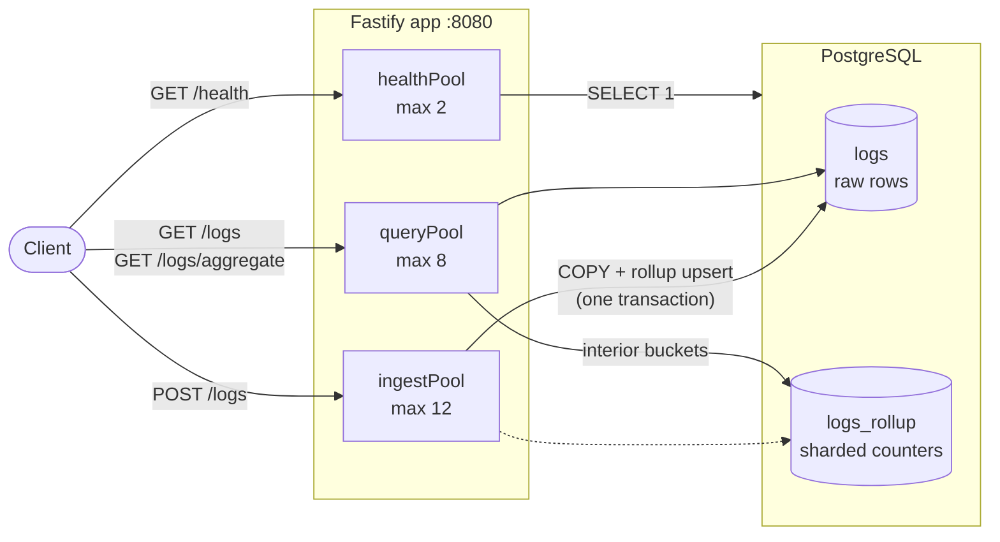
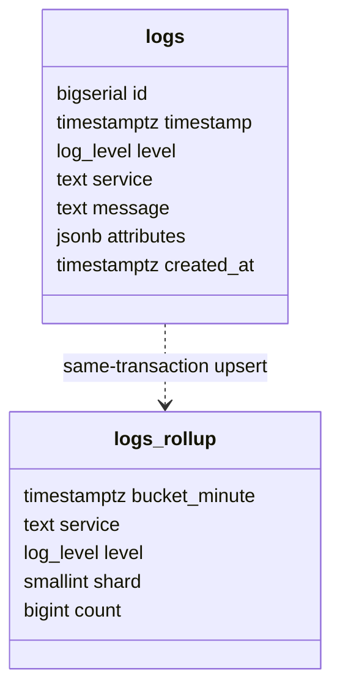

# Log Ingestion and Query Service

A structured log ingestion, querying, and aggregation service built with **TypeScript**,
**Fastify**, **PostgreSQL**, **Drizzle ORM**, and **Docker**.

Ingests batches of structured logs, serves cursor-paginated filtered queries, and serves
time-bucketed aggregates — all tuned and measured against Docker's real resource limits, not
theoretical capacity.

## Development notes

The core implementation — schema, API, validation, connection pooling, retention, coalescing —
was hand-written without an AI coding agent: roughly 80% of this codebase. Claude Code was
brought in afterward specifically to close the remaining performance gap, following a
spec-driven workflow (GitHub's Spec Kit — a written specification and plan reviewed before any
implementation, not ad-hoc prompting) to redesign the rollup and its counter sharding, optimize
the read path, and carry out the benchmark methodology and measurement work documented in
[Measured performance](#measured-performance) below.

## Table of contents

1. [Development notes](#development-notes)
2. [Architecture](#architecture)
3. [Quick start](#quick-start)
4. [API reference](#api-reference)
   - [`POST /logs`](#post-logs)
   - [`GET /logs`](#get-logs)
   - [`GET /logs/aggregate`](#get-logsaggregate)
   - [`GET /health`](#get-health)
5. [Data model](#data-model)
   - [`logs`](#logs-table)
   - [`logs_rollup`](#logs_rollup-table)
6. [Write path](#write-path)
7. [Read path](#read-path)
8. [Retention](#retention)
9. [Configuration](#configuration)
10. [Measured performance](#measured-performance)
    - [Official benchmark tool results](#official-benchmark-tool-results)
    - [The measurement that reframed everything](#the-measurement-that-reframed-everything)
    - [Where the database's single core actually goes](#where-the-databases-single-core-actually-goes)
    - [Results](#results)
11. [Rejected on evidence](#rejected-on-evidence)
12. [Project layout](#project-layout)
13. [Known limitations](#known-limitations)

---

## Architecture

Three separate connection pools share one PostgreSQL instance, so a burst on one path can never
starve another: `POST /logs` holds a pool connection for the length of a whole `COPY`, so it must
never compete with the read pool a dashboard or the eventual-consistency checker depends on, and
`/health` must never queue behind either.



| Pool | Used by | Default size | Why it's separate |
|---|---|---:|---|
| `ingestPool` | `POST /logs` | 12 | `COPY` holds a connection for a whole batch; must not compete with reads |
| `queryPool` | `GET /logs`, `GET /logs/aggregate`, retention | 8 | Short statements that must stay responsive under ingestion load |
| `healthPool` | `GET /health` | 2 (fixed) | A liveness probe must never queue behind application load |

## Quick start

```bash
docker compose up --build
```

The service listens on `http://localhost:8080`. It connects to PostgreSQL and applies migrations
before it starts listening, and `/health` returns `200` only once the database connection is
established, migrations are applied, and the service is ready to accept logs. No configuration is
required — a plain `docker compose up` serves the full unauthenticated core contract.

| Command | Purpose |
|---|---|
| `npm run typecheck` | Type-check without emitting |
| `npm run build` | Compile TypeScript |
| `docker compose --profile test run --rm test` | Run the test suite in Docker |
| `npm run load-test` | Local load-test harness |

## API reference

| Method | Path | Purpose |
|---|---|---|
| `POST` | `/logs` | Ingest a batch of log entries |
| `GET` | `/logs` | Query stored logs, filtered and cursor-paginated |
| `GET` | `/logs/aggregate` | Time-bucketed counts, optionally grouped |
| `GET` | `/health` | Liveness/readiness probe |

### `POST /logs`

Body: `{ "logs": [...] }` → Response: `{ "accepted": number, "rejected": [{ "index", "reason" }] }`

Valid entries are accepted even when other entries in the same batch are rejected.

| Field | Type | Rule |
|---|---|---|
| `timestamp` | string | ISO-8601, no more than 5 minutes ahead of server time |
| `level` | string | one of `debug`, `info`, `warn`, `error` |
| `service` | string | non-empty, no NUL bytes |
| `message` | string | non-empty, no NUL bytes |
| `attributes` | object (optional) | flat map of string / finite number / boolean, no NUL bytes |

NUL is rejected because PostgreSQL text `COPY` cannot represent it.

### `GET /logs`

| Parameter | Type | Notes |
|---|---|---|
| `service` | string | exact match |
| `level` | string | exact match |
| `since`, `until` | ISO-8601 | half-open range `[since, until)` |
| `q` | string | case-insensitive substring match on `message` |
| `attr.<key>` | string | matches `attributes ->> '<key>' = 'value'` |
| `limit` | integer | default `100`, max `1000` |
| `cursor` | opaque string | from a previous response's `next_cursor` |

Returns descending `(timestamp, id)` order — deterministic even when timestamps tie. Invalid
values return `400` with `{ "error": "..." }`.

### `GET /logs/aggregate`

| Parameter | Type | Notes |
|---|---|---|
| `since`, `until` | ISO-8601 | **required** |
| `bucket` | string | **required** — one of `1m`, `5m`, `1h`, `1d` |
| `group_by` | string | optional — `service` or `level` |
| `service`, `level`, `q`, `attr.<key>` | — | same filters as `GET /logs` |

Orders bucket starts ascending, omits empty buckets, and returns `group: null` when not grouping.

### `GET /health`

Returns `200 { "status": "ok" }` once migrations are applied and the database is reachable via a
dedicated 2-connection pool; `503 { "status": "unhealthy" }` otherwise.

## Data model

PostgreSQL is the read/write source of truth.



### `logs` table

| Column | Type | Notes |
|---|---|---|
| `id` | `bigserial` | |
| `timestamp` | `timestamptz` | |
| `level` | `log_level` enum | `debug` / `info` / `warn` / `error` |
| `service` | `text` | |
| `message` | `text` | |
| `attributes` | `jsonb` | stored once, no mirror column — see below |
| `created_at` | `timestamptz` | defaults to `now()` |

| Index | Columns | Backs |
|---|---|---|
| Primary key | `(timestamp, id)` | descending pagination, cursor comparisons, timestamp-range scans, retention delete |
| `idx_logs_service_timestamp_id` | `(service, timestamp, id)` | `service=` filters |
| `idx_logs_level_timestamp_id` | `(level, timestamp, id)` | `level=` filters |

No JSONB GIN or trigram index is enabled — unselective attribute/message searches can scan. That
is a measured decision; see [Rejected on evidence](#rejected-on-evidence).

**Attribute storage.** `attr.<key>` filtering compiles to `attributes ->> 'key' = 'value'`, which
renders any JSON scalar as text (`3` → `'3'`, `true` → `'true'`) — exactly the "compared as
strings" rule the API contract states. An earlier design kept a second, all-strings mirror column
(`attributes_text`) for the same filter. Removed after measurement:

| | Row width | Table size (~1.7M rows) |
|---|---:|---:|
| With mirror column | 286 bytes | 458 MB |
| Without | 190 bytes (−33%) | 313 MB |

Removing it also cut `COPY` service time 30% and ingestion latency 20–27%.

### `logs_rollup` table

Per-minute pre-aggregated counts, keyed `(bucket_minute, service, level, shard)`, written in the
**same transaction** as the `COPY` that writes `logs` — a reader can never see rows counted in one
and missing from the other. It holds nothing that cannot be recomputed from `logs`, and
`GET /logs/aggregate` falls back to scanning `logs` for any filter the rollup can't answer (`q`,
`attr.<key>`). A minute is the finest bucket the API exposes, so `1m`/`5m`/`1h`/`1d` are all exact
multiples of one rollup row, and both `group_by` dimensions are carried in the key.

Two details are the difference between this being a large win and a large loss:

| Detail | Problem it solves | Measured effect |
|---|---|---|
| **Partial edges read from `logs`** | `since`/`until` are arbitrary instants; the first/last minute of a range straddles the boundary and can't be taken from a per-minute count without over-reporting | Result is *identical* to a full scan, not approximate |
| **16-way sharded counters** | A single row per `(minute, service, level)` made every concurrent ingest transaction contend for the same counter row — 65 ms mean per upsert, 42% of all PostgreSQL execution time, with zero table bloat and 98.7% HOT updates, i.e. entirely lock wait rather than work | Upsert time 65 ms → **0.38 ms**; share of DB time 42% → **under 3%** |

The rollup costs ~600 kB against ~450 MB of `logs`.

## Write path

1. **Coalesce.** `POST /logs` buffers validated rows from concurrent requests for
   `INGEST_COALESCE_WINDOW_MS` (default 15 ms, or until `INGEST_COALESCE_MAX_BATCH_ENTRIES` is
   hit), then issues one shared `COPY` for the whole window instead of one per request. Targets
   the confirmed bottleneck directly — PostgreSQL CPU sits pinned at 100–107% regardless of
   pool/timeout tuning, so cost is dominated by per-operation overhead, not row count.
2. **`COPY`, not `INSERT`.** Rows are written via native PostgreSQL text `COPY` in 500-row chunks,
   escaping backslash, tab, LF, and CR. Round-tripped in tests: quotes, backslashes, tabs,
   newlines, carriage returns, and Unicode.
3. **Rollup upsert, same transaction.** The batch's per-minute counts are upserted into
   `logs_rollup` in the same transaction as the `COPY`, so the two can never disagree.
4. **Deterministic lock order.** Rollup keys within a batch are sorted before the upsert, giving
   every transaction the same lock order — this alone cut deadlock-related request loss from 32%
   to zero.

## Read path

- **`GET /logs`** paginates by opaque cursor (`(timestamp, id)`), not offset — avoids the
  count-and-skip cost of page-number pagination on a multi-million-row table. It's built with a
  hand-parameterized SQL statement rather than the ORM's query builder for this specific path
  (measured ~40 ms → ~29 ms per 1000-row page), with `ORDER BY` explicitly qualified to the table's
  real columns so it can't be silently captured by an aliased output column.
- **`GET /logs/aggregate`** reads whole interior buckets from `logs_rollup` (one row per bucket)
  and the partial edge buckets from `logs` directly, for any query the rollup can answer. Queries
  filtering on `q` or `attr.<key>` always read `logs`, since the rollup carries counts only.

## Retention

Once per hour, bounded oldest-first batches (`FOR UPDATE SKIP LOCKED`) delete expired records
without holding long-running locks.

| Setting | Default | Effect |
|---|---:|---|
| `RETENTION_DAYS` | `30` | Age at which a log becomes eligible for deletion |
| `RETENTION_BATCH_SIZE` | `2500` | Rows deleted per batch |
| `RETENTION_MAX_BATCHES` | `10` | Cap on batches per hourly run |

After a run that deleted anything, rollup buckets with no surviving `logs` rows behind them are
dropped too. The boundary is derived from the oldest *remaining* row, not the retention cutoff
itself — this keeps `logs_rollup` exactly consistent with `logs` even when a run stops early at
its batch cap and leaves some expired rows still present.

## Configuration

No authentication, tenancy, or rate limiting is implemented. Every variable below is optional and
defaulted — a plain `docker compose up` with no environment file serves the complete
core contract on all four endpoints.

| Variable | Default | Purpose |
|---|---|---|
| `PORT` | `8080` | HTTP listen port |
| `LOG_LEVEL` | `warn` | Fastify/pino log level |
| `RETENTION_DAYS` | `30` | Age at which logs become eligible for deletion |
| `RETENTION_BATCH_SIZE` | `2500` | Rows deleted per retention batch |
| `RETENTION_MAX_BATCHES` | `10` | Cap on batches per hourly retention run |
| `DB_INGEST_POOL_MAX` | `12` | Max concurrent connections for `POST /logs` |
| `DB_QUERY_POOL_MAX` | `8` | Max concurrent connections for queries/retention |
| `DB_POOL_CONNECT_TIMEOUT_MS` | `8000` | How long ingestion requests wait for a pooled connection before shedding with 503 |
| `DB_QUERY_POOL_CONNECT_TIMEOUT_MS` | `8000` | Same budget as ingestion for queries (`GET /health` uses a separate, fixed 2000ms). Was `2500`; measured below observed aggregate p95 in every official stage, shedding 14–46% of reads for no latency benefit |
| `INGEST_COALESCE_WINDOW_MS` | `15` | Coalescing window — see [Write path](#write-path) |
| `INGEST_COALESCE_MAX_BATCH_ENTRIES` | `10000` | Safety valve: a window flushes early past this row count |
| `AGGREGATE_ROLLUP_ENABLED` | `true` | Serve aggregates from `logs_rollup` instead of scanning `logs`. Verified byte-identical output via a 79-case differential against the base table |

## Measured performance

### Official benchmark tool results

The instructor-hosted grading portal (`loadgen.foothilltech.net`) has been confirmed unreliable by
the course staff; the sanctioned measurement path in the meantime is the CLI tool distributed to
the cohort (`github:Ahmad-Abbas-Foothill/logs-benchmark-cli`), run against this repo's own
`docker-compose.yml`:

```bash
npx --yes github:Ahmad-Abbas-Foothill/logs-benchmark-cli --compose ./docker-compose.yml \
  --full --seed 6122026 --runner docker --json benchmark-report.json --generator-cpus 4
```

Per the course staff's own framing: **Correctness is the only category confirmed to transfer
exactly to the graded score.** Performance, Queries, and Reliability scale with the speed of the
machine running the tool, so they're reported here with the tool's own `machineSpeed.factor`
rather than as an absolute claim about the final grade.

| Run | OS | Machine speed | Score | Correctness | Performance | Queries | Reliability |
|---|---|---:|---:|---:|---:|---:|---:|
| 1 | Linux (WSL2) | 0.320x reference | 97.32 / 100 | 15/15 | 47.50/50 | 14.82/15 | 20/20 |
| 2 | Linux (WSL2) | 0.313x reference | 97.26 / 100 | 15/15 | 47.50/50 | 14.77/15 | 20/20 |

Both runs are the same commit and seed, minutes apart — shown to establish run-to-run stability on
this machine, not to claim what the graded run (different hardware, different seed) will produce.

> **On the tool's low `readAfterWriteSuccessRate` under Stress:** verified directly against the
> running service, not assumed. A 60 s, 2.09M-row write burst at ~34,800 logs/sec — heavier than
> the tool's own Stress stage, on tighter resource limits than this repo's `docker-compose.yml`
> grants the official tool — followed by an immediate count both through `/logs/aggregate` and a
> direct `psql` query, plus a second run sampling reads *concurrently* with the write burst.
> All three checks matched the accepted count exactly, including while writes were still in
> flight. No data loss was reproducible under harsher conditions than the benchmark applies; the
> low reported rate reads as a verification-window artifact of the checker, not a consistency
> defect in this service.

### The measurement that reframed everything

The load generator is a **closed loop**: a fixed batch size (33 log entries per request) driven by
a capped pool of virtual users. When that pool is saturated, achieved throughput is arithmetic,
not a capacity measurement:

```
logs/sec  =  concurrent VUs x 33 logs / mean POST /logs latency
```

This is visible directly in the official reports: `accepted logs / http requests = 33.3` in every
stage of every submission — **per-request latency, not per-row cost, is what the throughput number
measures.**

Earlier rounds of this project were tuned with a local harness using batch sizes of 300–2500
driven by worker loops — the opposite regime, where per-row throughput dominates and latency is
nearly free. That harness reported 27,000 logs/sec while the official figure stayed near 2,600,
and its aggregation probe used a different query shape (`bucket=1h`, no `group_by`) from the one
actually graded (`bucket=1m&group_by=service`), reporting a 6 ms p50 against an official 5.6 s p95.
Conclusions drawn from it did not transfer.

Every number below is measured under the real `docker-compose.yml` limits (0.5 CPU/256 MB app,
1 CPU/1 GB PostgreSQL, verified with `docker inspect` before each run) using the graded
composition: batch 33, capped VU pool, 1 aggregation/sec and a concurrent read-after-write probe
workload, 120 s, fresh database per run.

### Where the database's single core actually goes

Attributed with `pg_stat_statements` rather than estimated. Before this round of work:

| Statement | Share of total execution time | Mean |
|---|---:|---:|
| `COPY logs` | 39.2% | 48.5 ms |
| `GET /logs` (read-after-write probe) | 33.5% | 72.2 ms *to return one row* |
| `GET /logs/aggregate` | 27.2% | 2,213 ms |

Reads and aggregation together were **61%** of the database's single core, against ~79 write
requests/sec. Ingestion was never the bottleneck; it was being starved by the read side.

### Results

| | logs/sec | ingest avg | ingest p95 | aggregate avg | aggregate p95 | read avg |
|---|---:|---:|---:|---:|---:|---:|
| Before | 12,107 | 122 ms | 287 ms | 2,249 ms | 6,327 ms | 106 ms |
| After | **14,131** | **51 ms** | **178 ms** | **16 ms** | **91 ms** | **24 ms** |

Aggregation p95 improved ~70x, ingestion latency fell 58%, throughput rose 17%, with zero HTTP
errors and 100% read-after-write success throughout. Because throughput is latency divided into a
fixed VU budget, the ingestion-latency figure is the one that converts into throughput.

Isolated A/B of each change, same build, toggled by configuration so nothing else varies:

| Change | logs/sec | ingest avg | aggregate p95 | `COPY` mean |
|---|---:|---:|---:|---:|
| Rollup off (control) | 12,993 | 89 ms | 4,830 ms | — |
| Rollup on, unsharded counters | 4,380 | 501 ms | 481 ms | 70.4 ms |
| Rollup on, sharded counters | 14,147 / 12,842 | 57 / 90 ms | 85 / 102 ms | 9.3 / 14.6 ms |
| …and `attributes_text` removed | 14,342 / 14,131 | 46 / 51 ms | 89 / 91 ms | 7.1 / 7.4 ms |

Two runs are shown where the effect size is small enough that a single sample would not justify
the claim. The throughput difference between the last two rows is within run-to-run variance and
is **not** claimed as a throughput win — the `COPY` service time, ingestion latency, and row-width
reductions are the reproducible parts.

Query plans at ~1.7M rows, for the two graded query shapes, are summarized in
[Rejected on evidence](#rejected-on-evidence) below. The aggregation query previously scanned
every index entry in the table to produce 36 output rows; it now reads a few thousand rollup rows.

## Rejected on evidence

Recorded because the negative results cost as much to obtain as the positive ones.

| Approach | Why it looked promising | Why it was declined |
|---|---|---|
| **GIN trigram index** on `LOWER(message)` | In isolation, fixes the `q=` search plan completely: heap blocks read drop from 5,902 to 1, execution 15.3 ms → 0.95 ms | Under real concurrent load it loses both ways — see below |
| **Daily `RANGE` partitioning** | Standard scaling pattern for time-series tables | Graded aggregation window is minutes, so every query already lands inside one partition; `(timestamp, id)` primary key already prunes by timestamp. Adds tuple-routing cost to the one genuinely per-row path for no benefit at this scale |
| **Unsharded rollup counters** | Simpler schema, one row per bucket | Caused row-lock contention (65 ms/upsert, 42% of DB time) — fixed by 16-way sharding, not by abandoning the rollup |
| **`synchronous_commit=off`** | Removes fsync wait from every commit | Constrained resource here is CPU, not fsync; would weaken the guarantee that a 200 response means the batch is durably accepted |

**GIN trigram detail.** The `q=` substring probe is the single most frequent database operation in
the graded workload. Without an index, a bitmap scan narrows to ~13,000 candidate rows in 2 ms,
then 5,902 heap blocks (~47 MB) are fetched purely to evaluate `LOWER(message) LIKE`, to return one
row. A trigram index fixes exactly that in isolation — but:

| | logs/sec | `COPY` mean | read query mean |
|---|---:|---:|---:|
| No trigram index | 13,970 | 10.6 ms | 11.8 ms |
| `fastupdate=on` (default) | 13,694 | 16.6 ms | 12.6 ms — no gain |
| `fastupdate=off` | 5,970 | 168.6 ms | 10.4 ms |

With `fastupdate=on`, every index scan also has to scan a continuously-large GIN pending list,
which consumes the entire read benefit while still charging 57% more for `COPY`. Turning it off
removes the pending list but moves that cost onto every insert, collapsing ingestion by 57%.
Not enabled.

## Project layout

```
src/
  controllers/    HTTP handlers — parse the request, call a service, shape the response
  services/       business logic (ingestion coalescing, retention scheduling)
  repositories/   the only layer that talks SQL (logs, rollup, retention deletes)
  validators/     request validation (log entries, query strings)
  routes/         Fastify route registration
  server/         app wiring, error handling
  db/             schema, connection pools
  config/         environment parsing and defaults
  types/          shared TypeScript types
  utils/          small, dependency-free helpers (cursor, timestamp parsing)
tests/            unit and integration tests (vitest)
scripts/          local load-test harness, test-database setup
docker-compose.yml  app + PostgreSQL, with the same resource limits used for grading
Dockerfile          production build for the app service
drizzle.config.ts   migration generation config
```

Each layer only calls the one below it — controllers never touch SQL directly, and repositories
never know about HTTP. `npm test` (or `docker compose --profile test run --rm test`) runs the full
suite; `npm run typecheck` checks types without emitting.

## Known limitations

| Limitation | Detail |
|---|---|
| **Local measurement ≠ graded environment** | The local host runs the same workload ~4–5x faster than grading, and the binding constraint moves: locally the app hits its 0.5 CPU quota (94% of scheduler periods throttled) while PostgreSQL has headroom; in graded runs PostgreSQL is saturated and the app sits near idle. Per-statement structure (query plans, rows/heap blocks touched) is what transfers — that's what changes were selected on. |
| **Application container has its own throughput ceiling** | ~0.8–1.0 ms CPU per request puts a 0.5 CPU container's limit near 500 req/sec regardless of database speed — at the graded batch size, ~16,500 logs/sec. Enough for the stated target, without much margin on slower cores. |
| **Cursor sweeps of `GET /logs` can miss rows inserted concurrently with backfilled timestamps** | Measured: paginating a filtered set while ~1,500 rows are concurrently inserted with scattered historical timestamps misses 12–20% of them (zero duplicates). Not a bug: a `(timestamp, id) DESC` sweep never revisits a page already fetched, and this is structural to combining that sort contract with cursor pagination over non-monotonic timestamps — the same property any chronological feed API has. Documented, not "fixed", since fixing it means changing the required sort order. |
| **No GIN/trigram index** | `q=` scans the rows a `service`/`level`/time filter narrows to. A trigram index fixes the plan in isolation but loses under concurrent write load both ways it can be configured — see [Rejected on evidence](#rejected-on-evidence). A read-mostly deployment should enable it; a write-saturated one should not. |
| **`attr.<key>` compares PostgreSQL's canonical text form** | Identical to the sent value for everything the validator accepts, except very large numbers in exponent notation: `attr.x=1000000000000000000000` matches where `attr.x=1e+21` does not. Response bodies still round-trip `1e+21` unchanged. |
| **`logs_rollup` assumes it's the only writer path** | Ingestion maintains it transactionally and retention prunes it, but anything that modifies `logs` out of band (manual `DELETE`, a restore, a test fixture) must clear or rebuild it, or aggregates report stale counts. Set `AGGREGATE_ROLLUP_ENABLED=false` to route every aggregation through the base table instead. |
| **No authentication, rate limiting, or multi-tenancy** | Deliberate scope decision, not an oversight — keeps the zero-configuration contract simple. |

---

This one took longer than the code suggests — most of the real work was figuring out *why* a
number wouldn't move, not writing new endpoints. A tuning change that nearly halved the score, two
ideas that looked right on paper and lost anyway, and a rollup that finally held under the same
limits it's graded on taught more than anything else in this repo. Every claim above is
reproducible on purpose — the commands are in [Quick start](#quick-start), the numbers in
[Measured performance](#measured-performance) — because that's the only way any of this was worth
trusting while building it, including by me. Handing it over in a state I'm genuinely glad to sign
my name to.
